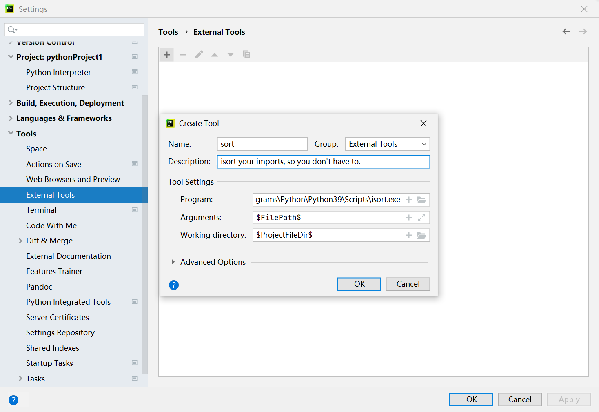
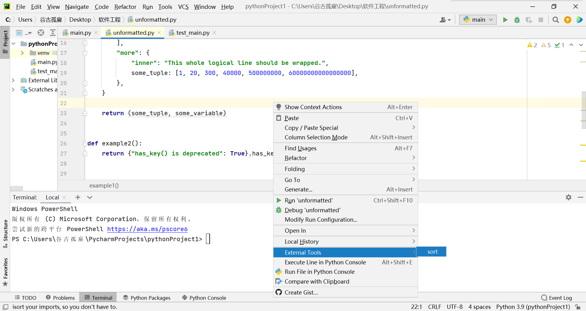

# Python isort包的使用
## <font color=red size=3>isort your imports, so you don't have to. </font> 
摘自[isort简介及使用详解](https://juejin.cn/post/7026151419459665957)  


&emsp;&emsp;isort 是一个实用的 Python 程序/库，用于按照字母表顺序对 imports 进行排序，并自动按类型（标准库/第三方库/自己的模块/……）划分部分。

&emsp;&emsp;它为各种编辑器提供了命令行程序、Python 库和插件，以快速对所有导入进行排序。需要 Python 3.6 + ，但也支持 Python 2 。

**来看官网给的例子**
```
# Before isort
from my_lib import Object
import os
from my_lib import Object3
from my_lib import Object2
import sys
from third_party import lib15, lib1, lib2, lib3, lib4, lib5, lib6, lib7, lib8, lib9, lib10, lib11, lib12, lib13, lib14
import sys
from __future__ import absolute_import
from third_party import lib3
print("Hey")
print("yo")
```
**使用isort格式优化后**
```
# After isort
from __future__ import absolute_import
import os
import sys
from third_party import (lib1, lib2, lib3, lib4, lib5, lib6, lib7, lib8,
                         lib9, lib10, lib11, lib12, lib13, lib14, lib15)
from my_lib import Object, Object2, Object3
print("Hey")
print("yo")
```
可以看到import 部分明显清爽、有条理了许多。
## 安装
安装非常简单，只需：
```
pip install isort
```
安装 isort 并支持 requirements.txt ：
```
pip install isort[requirements_deprecated_finder]
```
带 Pipfile 支持的 isort 安装：
```
pip install isort[pipfile_deprecated_finder]
```
支持两种格式的 isort 安装：
```
pip install isort[requirements_deprecated_finder,pipfile_deprecated_finder]
```

## 简单使用
### 命令行使用
在特定文件上运行：
```
isort mypythonfile.py mypythonfile2.py
```
递归地使用：
```
isort .
```
如果开启了 globstar ，则isort .等价于：
```
isort **/*.py
```
仅查看 isort 将做出的变更，但并不应用：
```
isort mypythonfile.py --diff
```
以原子方式对项目运行 isort，仅在不引入语法错误的情况下应用更改：
```
isort --atomic .
```
（注意：默认情况下这是禁用的，因为它可以防止 isort 针对使用不同版本的 Python 编写的代码运行。）
### 在 Python 内使用
```
import isort
isort.file("pythonfile.py")
```
或者
```
import isort
sorted_code = isort.code("import b\nimport a\n")
```

### 在 PyCharm 中使用
**添加**  
可以通过「外部工具」的方式将 isort 集成到 PyCharm 中。  

**找到isort的位置**  
命令行输入`where isort `

>打开文件 -> 设置 -> 工具 -> 外部工具


如果需要自定义其他选项，写在 $FilePath$ 前即可。


**使用**  
在已经打开的代码编辑界面（或项目文件树的某个目录上）鼠标右键，找到 External Tools -> isort，点击即可。



