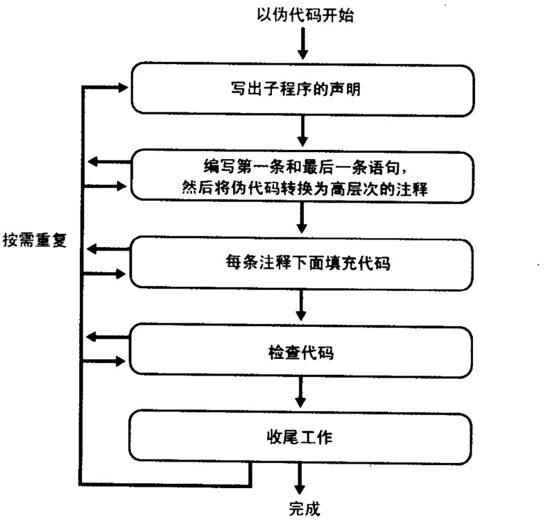

# 通过伪代码编码的过程创建子程序  
## 1 设计子程序
### 1.1 检查先决条件
    确认子程序工作是否定义好了，是否能与整体设计相匹配，以及该子程序是否真正需要。
### 1.2 定义子程序需解决的问题
    陈述子程序要解决的问题。若高层设计详细（输入、输出、前提条件、错误信息……），该工作已经完成。
### 1.3 为子程序命名
清晰，例如：ReportErrorMessage()
### 1.4 在标准库中搜寻可用功能
    了解公司代码库里是否有某些功能，以优化程序设计。
### 1.5 考虑错误处理
    若程序架构中定义了出错处理策略，遵循即可；否则，需根据特定的子程序确定最佳出错处理方式。
### 1.6 考虑效率问题
低级语言代替，资源和速度的目标。
### 1.7 研究算法和数据类型
    算法书中明确定义算法，转化为目标编程语言即可。
### 1.8 编写伪代码
    一句话写下该子程序的目的（注释），接着为盖子程序编写高层次的伪代码。
### 1.9 考虑数据
    定义好关键的数据类型。
### 1.10 检查伪代码
是否便于解释。
### 1.11 伪代码中实验一些想法，留下最好的（迭代）
    用伪代码反复描述该子程序，直到伪代码句子足够简单；若伪代码层次过高，需要分解。
## 2 编写子程序代码

    实施所有步骤，但不一定要按照任何特定的顺序。P226
    写一个简单的示例程序：由伪代码代码（C++/Java）
## 3 检查代码
### 3.1 在脑海中检查程序中的错误
### 3.2 编译子程序
### 3.3 调试器中逐行执行
### 3.4 测试代码
### 3.5 消除错误
### 4 收尾
    按照优秀代码的一般特性来检查，若该程序质量不佳，那就回到伪代码那一步，高质量的程序需要不断迭代，所以不要犹豫。
