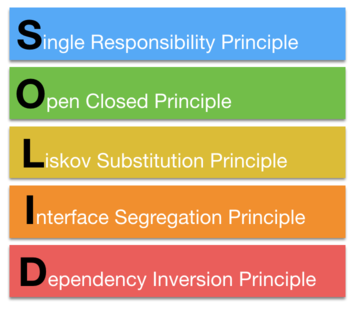

# SOLID原则


**SOLID**是五个**面向对象编程的重要原则**的缩写。另外，它也是每个开发者必备的基本知识。了解并应用这些原则能让你写出更优质的代码，变成更优秀的开发者。

## 我们把 SOLID 的字母拆开:

## 接下来我将具体阐述O（开闭原则）：
>软件实体（类，模块，方法等）应该对扩展开放，对修改封闭。

根据这一原则，一个软件实体能很容易地扩展新功能而不必修改现有的代码。

open for extension: 添加新的功能从而满足新的需求。

close for modification: 扩展新的功能行为而不需要修改现有的代码。

如果我们应用这个原则，我们会有一个可扩展的系统且在更改需求的时候更不易出错。我们可以用抽象和多态来帮助我们应用这个原则。
### 设计原则：
找出应用中可能需要变化之处，把他们独立出来，不要和那些不需要变化的代码混在一起。

### 好处：
>1.代码的可维护性和复用性。  
2.代码会更健壮。

### 例如:
- 我们有一个Duck类：
```
public class Duck {

    quack();    //呱呱叫
    swim();     //游泳
    display();  //外观

}
```
- 现在我们得让鸭子能飞
```
public class Duck {

    quack();    //呱呱叫
    swim();     //游泳
    display();  //外观
    fly();  //飞行

}
```
- 但是并非所有的鸭子都能飞，因此我们需要将quack()和fly()方法单独提出（因为，这两类行为都可能因为鸭子的不同而有所差异），建立一个新类来表示每种行为。
```
interface FlyBehavior(){
    fly(){
        ...
    }
}
interface QuackBehavior(){
    quack(){
        ...
    } 
}
public class Duck {
    QuackBehavior quackBehavior;
    //每只鸭子都会引用实现QuackBehavior接口的对象
    public void performQuack(){
        quackBehavior.quack();
        //鸭子对象不亲自处理呱呱叫行为，而是委托给quackBehavior引用的对象
    }

}

```
- 设定quackBehavior的实例变量
```
public class MallardDuck extends Duck{
    public MallardDuck(){
        quackBehavior = new Quack();
        //绿头鸭使用Quack类处理呱呱叫，所以当performQuack()被调用时，叫的职责被委托给Quack对象，而我们得到了真正的呱呱叫
        flyBehavior = new FlyWithWings();
        //使用FlyWithWings()作为真正的flyBehavior类型
    }
    public void display(){
        System.out.println("I'm a mallard duck!")
    }
}
